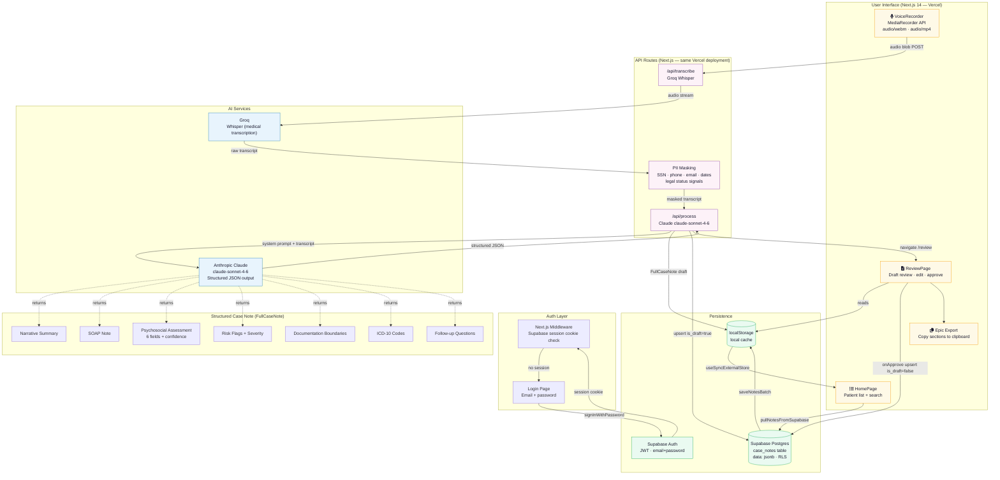

# CareNotes

CareNotes is an AI-assisted scribe tool for social workers. It turns post-visit voice reflections into structured, compliance-aware case notes — covering narrative summaries, SOAP notes, psychosocial assessments, ICD-10 diagnostic codes, and next-session follow-up questions — while flagging high-risk indicators and enforcing documentation boundaries.

All AI output is a draft. The clinician reviews, edits, and approves before anything is submitted to Epic.

## Architecture



**Data flow summary:**
1. Clinician speaks a post-visit reflection → browser captures audio via MediaRecorder
2. Audio POSTs to `/api/transcribe` → Groq Whisper returns a clinical transcript
3. PII masking strips SSNs, phone numbers, legal-status terms server-side
4. Masked transcript POSTs to `/api/process` → Claude returns a structured `FullCaseNote` JSON with 7 sections
5. Draft note saves to localStorage (instant) and Supabase (persistent, RLS-protected)
6. Clinician reviews, edits, enters name → approval upserts `is_draft=false` to Supabase
7. On next load, `pullNotesFromSupabase` hydrates localStorage so notes survive across devices

## Docs

- `docs/PRODUCT_BRIEF.md` — product framing, user research, and scope
- `docs/ARCHITECTURE.md` — system design and data flow
- `docs/COMPLIANCE.md` — HIPAA-first constraints and guardrails

## Setup

**Prerequisites:** Node.js 18+, an Anthropic API key, a Deepgram API key.

```
npm install
cp apps/web/.env.local.example apps/web/.env.local
```

Open `apps/web/.env.local` and fill in both keys:

```
ANTHROPIC_API_KEY=sk-ant-...
DEEPGRAM_API_KEY=...
```

## Running locally

```
npm run dev
```

Opens at `http://localhost:3000`.

## How to test it

The app runs as a three-page flow: record → review → export.

**Step 1 — Record**

Open `http://localhost:3000`. Click **Start Recording** and allow microphone access when prompted. Speak a brief post-visit reflection — describe presenting concerns, safety observations, interventions provided, and your follow-up plan. Then click **Stop Recording**.

Audio is transcribed by Deepgram (`nova-2-medical`, optimized for clinical speech) before being sent to Claude. Any PII or legal-status terms detected in the transcript are masked before leaving the server.

**Step 2 — Review**

After a few seconds, you are routed to `/review`. Use the tab bar to navigate between sections:

| Tab | Contents |
|---|---|
| SOAP | Subjective / Objective / Assessment / Plan |
| Narrative | Epic-format narrative summary (≤ 150 words, third person) |
| Psychosocial | 6 assessment fields, each with a confidence marker |
| Flags | Stress and risk keywords with severity ratings |
| Boundaries | Legal status omission notice + insurance phrasing suggestions |
| ICD Codes | Suggested ICD-10-CM diagnostic codes with confidence levels |
| Next Session | Clinician follow-up questions with clinical rationale |

Check that:

- The **DRAFT** banner is visible at the top
- Fields with low transcript coverage show `confidence: insufficient_data`
- Any stress or risk keywords appear in the Flags tab with severity ratings
- The Boundaries tab notes whether legal status content was detected and omitted
- ICD codes are grounded in the transcript — not speculative
- Follow-up questions are clinically specific, not generic

Edit any field directly in the textarea. When satisfied, enter your name in the approval field to enable **Approve & Export**.

**Step 3 — Export**

After approving, use the Copy button on each tab to paste sections into Epic or a text editor.

## Testing specific behaviors

**PII and legal status masking** — Include a phone number, email address, or a phrase like "probation" or "warrant" in your spoken reflection. These are masked in the transcript before it reaches Claude — check the masked transcript on the Transcript tab of the review page.

**Legal status leak detection** — If a legal/status term makes it through to Claude's output, the `/api/process` route detects it server-side and returns an error before the draft reaches the client.

**Insufficient data handling** — Record something sparse like "Client seemed okay, nothing specific to report." Psychosocial fields and ICD codes should return `confidence: insufficient_data` with placeholder values rather than hallucinated content.

**Mobile recording** — Open `http://localhost:3000` on an iOS or Android device (same local network, or use a tunnel like ngrok). iOS Safari uses `audio/mp4`; Android Chrome uses `audio/webm` — both are handled automatically.

## Repo structure

```
apps/web/        Next.js 14 app — UI and API routes
packages/shared/ Shared TypeScript types and constants
apps/api/        Legacy stub — not used
docs/            Product and technical documentation
```

## AI features

| Feature | How it works |
|---|---|
| Voice transcription | Deepgram `nova-2-medical` — trained on clinical speech, handles medical abbreviations and terminology |
| PII masking | Regex patterns on the server strip SSNs, phone numbers, emails, dates, and addresses before any AI processing |
| Legal status enforcement | `LEGAL_STATUS_SIGNALS` list blocks terms from both the transcript (masking) and the output (leak detection) |
| Narrative summary | Epic-format, past tense, third person, ≤ 150 words |
| SOAP note | 4-section structured note with therapeutic intervention descriptions |
| Psychosocial assessment | 6 required fields, each with a `high / medium / low / insufficient_data` confidence marker |
| Risk flags | Keywords and phrases flagged with severity (`high / medium / low`) and transcript context |
| Documentation boundaries | Tracks what was omitted and why; suggests insurance-ready phrasing |
| ICD-10 codes | 1–5 ICD-10-CM codes grounded in the transcript with confidence levels |
| Follow-up questions | 2–4 clinically specific questions for the next session with rationale |
| Draft enforcement | `isDraft: true` is a TypeScript literal type — output cannot be treated as final without explicit clinician approval |
